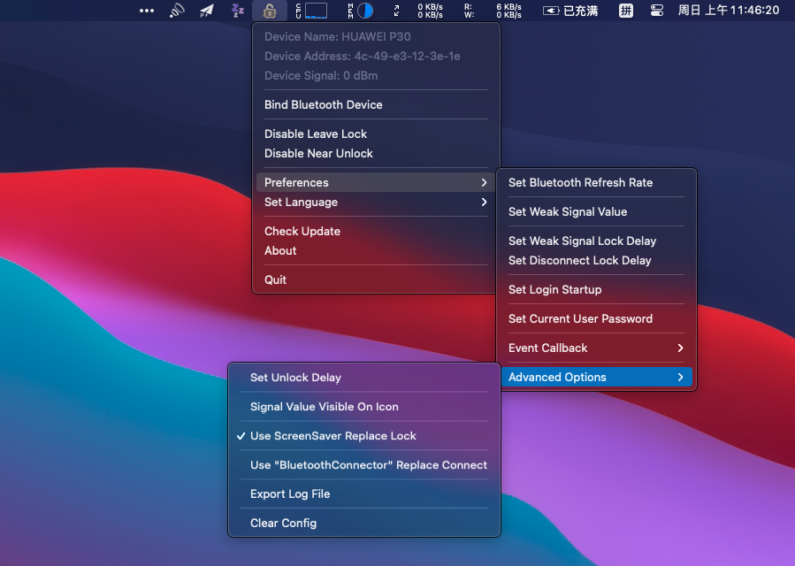

# UnlockerX

Near unlock your Mac by Bluetooth device!

* Multiple language support ! ! !
  * English
  * Simple Chinese
  * Tradtional Chinese
  * Japanese (By Translater)
  * Korean (By Translater)

* Events callback execute custom program support !!!
  * Signal Weak
  * Connect Status Changed
  * Lock Status Changed
  * Lid Status Changed

Base on above contents, You can free to extend this program. (example code on folder "/docs/".)

This program can work normally in macOS 10.14. (Tested on MacBook Pro 2019)



## If Unlock Failed (Update Application)

You need to reactivation control permission.

Open "System Preferences" - "Security" - "Privacy" - "Accessibility", Re-check "UnlockerX".

## Downloads

Please view [Releases Page](../../releases).

## How To Build

* Install Requirement.

```bash
pip3 install -r requirements.txt
```

* Build

```bash
python3 build.py
```

## Report Bug

If you meet some bug in this app, You can try to export log (in "Preferences" - "Advanced Options"), and send to this project issues page.

It will be export log file to directory, your private data will replace with hider text.

And the next step, you can send this log file on this project' s GitHub page issues.
