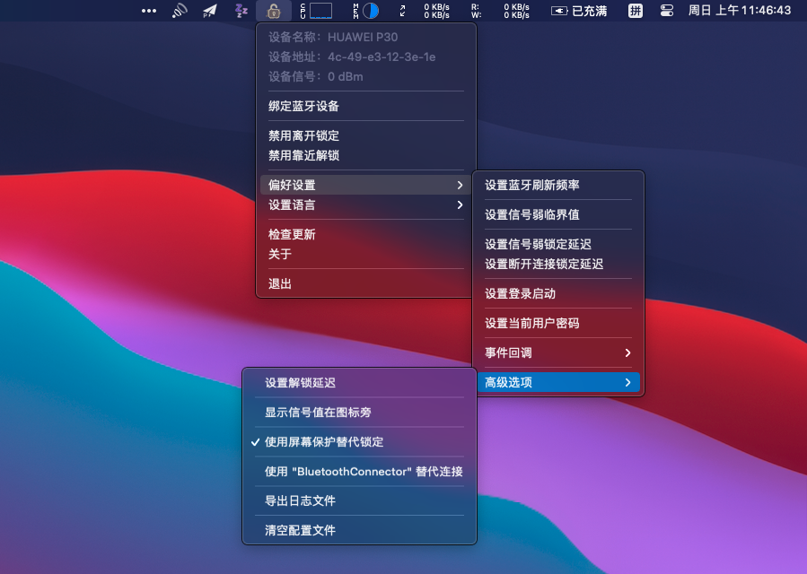

# UnlockerX

使用蓝牙设备靠近以解锁你的Mac！

* 多语言支持 ！！！
  * 英文
  * 简体中文
  * 繁体中文
  * 日文（翻译）
  * 韩文（翻译）

* 事件回调支持执行自定义程序！！！
  * 信号弱
  * 连接状态改变
  * 锁定状态改变
  * 合盖状态改变

基于以上内容，你可以自由地扩展这个程序。（示例代码在 "/docs" 目录下）



## 下载

请查看[Releases页面](../../releases)。

## 如何构建

* 安装依赖包

```bash
pip3 install -r requirements.txt
```

* 构建

```bash
python3 build.py
```


## 提交Bug

如果你在这个应用遇到问题，您可以尝试导出日志（在“偏好设置”-“高级选项”），并发送到这个项目的 issues 页面。

这将会导出日志文件到目录，你的隐私数据将会被屏蔽文字所替换。

下一步，你可以将这个日志文件发送到这个项目的GitHub页面的issues。
